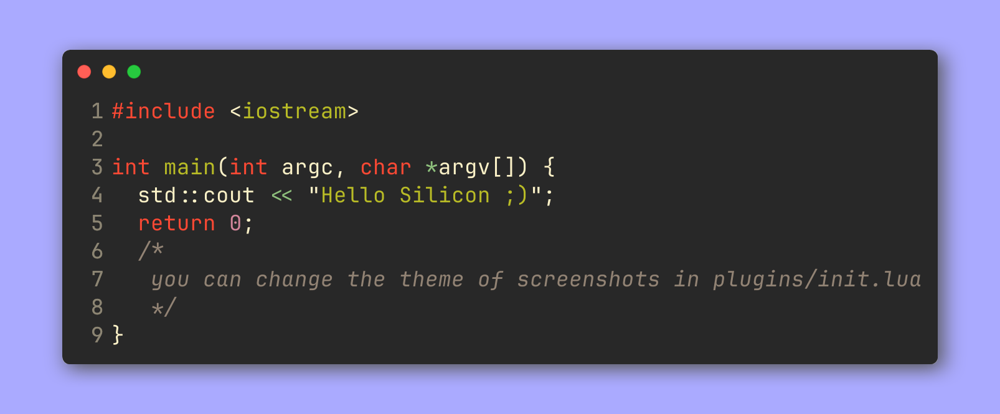

# Neovim CPP

[](https://github.com/dreamsofcode-io/neovim-cpp/blob/main/LICENSE)

this repository is a my personal neovim configs which i use to code in C++.

## Table of Contents

- [Neovim CPP](#neovim-cpp)
  - [Table of Contents](#table-of-contents)
  - [Installation](#installation)
  - [Usage](#usage)
  - [Silicon](#silicon)
  - [Shell-Script](#shell-script)
  - [Credits](#credits)

## Installation

To install Neovim CPP, follow these steps:

1. Clone the repository:
```bash
git clone https://github.com/dreamsofcode-io/neovim-cpp.git --depth 1
```
2. Change to the project directory:
  ```bash
cd neovim-cpp
```
3. Run the shell script to install the dependencies:
```bash
sh install.sh
```


## Usage

After installation, you can start using Neovim. The plugins and configurations included in this project will provide you with a comfortable and efficient environment for C++ development.

## Silicon
if you decide to install Silicon configs, the script will do it automatically, all you have to do is go to visual mode and select the code, then use command "Silicon". this is an example image taken by Silicon:


## Shell-Script

The `install.sh` shell script is responsible for installing the necessary dependencies for this repository. this script will open nvim with MasonInstallAll command to install all necessary plugins by adding it into init.lua file. so if the script didn't remove MasonInstallAll command from init.lua, you can remove it manually by running this in your terminal:
```bash
sed -i '/^vim.cmd("MasonInstallAll")$/d' ~/.config/nvim/init.lua
```

## Credits

thanks to [dreamsofcode-io](https://github.com/dreamsofcode-io) for their base setup
